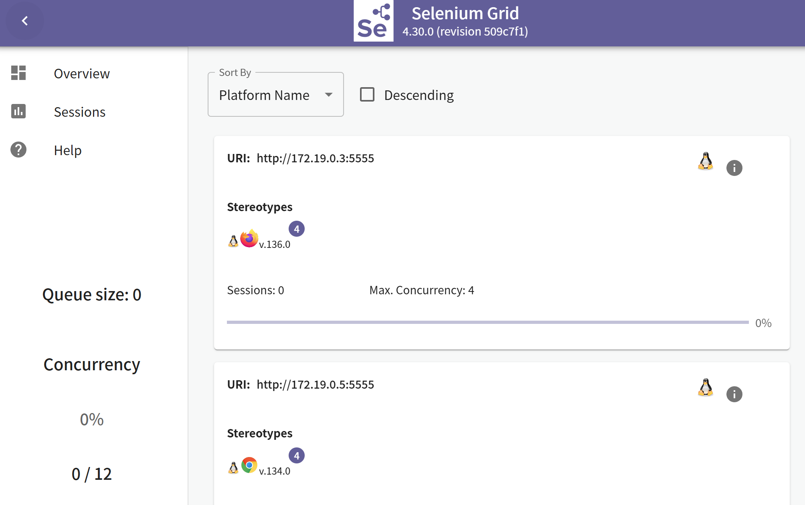

# 项目-百度selenium grid

## 环境配置

通过git下载到本地

```
git clone https://github.com/HaiWenShangJing/selenium-project.git
```

创建Python虚拟环境并安装依赖

```
# 启动虚拟环境（Windows）
python -m venv venv
venv\Scripts\activate
# 安装依赖
pip install -r requirements.txt
```

## 项目执行过程

启动selenium grid

```bash
docker-compose up -d
```

配置config.json（可选）

执行测试命令

```bash
pytest
```

查看效果

本地http://localhost:4444



执行中


执行结束

```bash
(venv) PS C:\Users\Jack\source\selenium_grid_test> pytest
============================================ test session starts ============================================
platform win32 -- Python 3.11.2, pytest-8.3.5, pluggy-1.5.0 -- C:\Users\Jack\source\selenium_grid_test\venv\Scripts\python.exe
cachedir: .pytest_cache
metadata: {'Python': '3.11.2', 'Platform': 'Windows-10-10.0.22621-SP0', 'Packages': {'pytest': '8.3.5', 'pluggy': '1.5.0'}, 'Plugins': {'html': '4.1.1', 'metadata': '3.1.1'}}
rootdir: C:\Users\Jack\source\selenium_grid_test
configfile: pytest.ini
testpaths: tests/
plugins: html-4.1.1, metadata-3.1.1
collected 6 items

tests/test_baidu_search.py::test_baidu_search_without_login[chrome] PASSED                             [ 16%]
tests/test_baidu_search.py::test_baidu_search_without_login[edge] PASSED                               [ 33%]
tests/test_baidu_search.py::test_baidu_search_without_login[firefox] PASSED                            [ 50%]
tests/test_baidu_search.py::test_baidu_search_with_login[chrome] SKIPPED (没有有效的登录cookie，跳...) [ 66%]
tests/test_baidu_search.py::test_baidu_search_with_login[edge] SKIPPED (没有有效的登录cookie，跳过...) [ 83%]
tests/test_baidu_search.py::test_baidu_search_with_login[firefox] SKIPPED (没有有效的登录cookie，...)  [100%]

- Generated html report: file:///C:/Users/Jack/source/selenium_grid_test/reports/test_report_20250330_214156.html -
======================================= 3 passed, 3 skipped in 34.93s ======================================= 
(venv) PS C:\Users\Jack\source\selenium_grid_test> 
```

## 项目结构

```
c:\Users\Jack\source\selenium_grid_test\
├── 📂 pages\                          # 页面对象封装
│   ├── baidu_page.py                 # 百度搜索页操作
│   └── search_result_page.py         # 搜索结果页操作
│
├── 📂 tests\                         # 测试用例目录
│   └── test_baidu_search.py          # 百度搜索测试用例
│
├── 📂 reports\                       # 测试报告存储（自动生成）
│   ├── test_report_*.html            # HTML报告
│   └── screenshots\                  # 失败截图
│
├── docker-compose.yml                # Docker Grid 配置 ← 新增的核心文件
│   ├── selenium-hub                 # Grid 中心节点（4444端口）
│   ├── chrome-node                  # Chrome 节点（5900 VNC）
│   ├── firefox-node                 # Firefox 节点
│   └── edge-node                    # Edge 节点
│
├── conftest.py                       # pytest 核心配置
│   ├── driver()                      # 浏览器驱动fixture
│   ├── grid_url()                    # Grid 地址配置
│   └── 报告系统配置
│
├── pytest.ini                        # pytest 运行配置
├── config.json                       # Cookie 配置文件
└── requirements.txt                  # Python 依赖库

[pytest 测试] → [Selenium Grid] → [浏览器节点]
       ↑               ↑
    (conftest)    (docker-compose)
       ↓               ↓
[生成报告] ←── [截图/日志] ←── [实际浏览器]
```

## 项目执行过程

```

┌───────────────────────────────┐
│          pytest 命令           │
└──────────────┬────────────────┘
               ▼
┌───────────────────────────────┐
│ 1. 加载配置                   │
│   c:\...\pytest.ini          │
│   → 读取命令行参数和全局设置     │
└──────────────┬────────────────┘
               ▼
┌───────────────────────────────┐
│ 2. 初始化测试环境              │
│   c:\...\conftest.py          │
│   → 注册fixtures(driver等)     │
│   → 配置HTML报告路径           │
└──────────────┬────────────────┘
               ▼
┌───────────────────────────────┐
│ 3. 测试发现阶段               │
│   c:\...\tests\              │
│   → 扫描test_*.py文件         │
│   → 导入pages包              │
│     c:\...\pages\__init__.py │
│     → 暴露BaiduPage等         │
└──────────────┬────────────────┘
               ▼
┌───────────────────────────────┐
│ 4. 测试执行流程               │
├───────────────────────────────┤
│ ① driver fixture初始化       │
│   → 创建远程WebDriver实例      │
│   → 连接Selenium Grid:4444    │
├───────────────────────────────┤
│ ② 执行测试用例                │
│   test_baidu_search.py        │
│   → 打开百度页面               │
│   → 搜索操作 → 验证结果        │
├───────────────────────────────┤
│ ③ 钩子函数拦截                │
│   → 失败时截图 → 追加到报告     │
└──────────────┬────────────────┘
               ▼
┌───────────────────────────────┐
│ 5. 生成测试报告               │
│   c:\...\reports\            │
│   → HTML报告+截图             │
└──────────────┬────────────────┘
               ▼
┌───────────────────────────────┐
│ 6. 资源清理                  │
│   → 关闭浏览器实例(driver.quit)│
└───────────────────────────────┘
```

## 项目参数传递

```
┌───────────────────────────────┐
│       执行 pytest 命令          │
└──────────────┬────────────────┘
               ▼
┌───────────────────────────────┐
│ 1. 加载 conftest.py 的 fixtures│
│   ① grid_url()               │
│     → 返回 "http://localhost:4444" (session 作用域)
└──────────────┬────────────────┘
               ▼
┌───────────────────────────────┐
│ 2. 参数化驱动初始化            │
│   ② driver(request, grid_url) │
│     → request.param 接收参数 ['chrome', 'edge', 'firefox']
│     → grid_url 来自上一步
└──────────────┬────────────────┘
               ▼
┌───────────────────────────────┐
│ 3. 测试函数参数注入            │
│   test_baidu_search_with_login│
│   (driver, cookies)           │
├───────────────────────────────┤
│ 参数传递链：                  │
│ driver → 需要 grid_url         │
│ cookies → 需要 load_cookies()  │
└──────────────┬────────────────┘
               ▼
┌───────────────────────────────┐
│ 4. fixture 生命周期           │
│   grid_url: session 作用域    │ 只创建1次
│   driver: function 作用域      │ 每个测试函数创建3次（3浏览器）
│   cookies: function 作用域    │ 每个测试函数创建1次
└───────────────────────────────┘
```

```python
# conftest.py 中定义
@pytest.fixture(scope="session")          # ← 最先被调用
def grid_url():                           # 1
    return "http://localhost:4444"        # 2 → 传递给 ↓

@pytest.fixture(params=['chrome', 'edge', 'firefox'])
def driver(request, grid_url):            # 3 ← 接收 grid_url
    browser = request.param               # 4 ← 接收参数化值
    # 创建对应浏览器的 driver → 传递给 ↓

# test 文件中使用
def test_baidu_search_with_login(driver, cookies):  # 5 ← 接收 driver 和 cookies
    # driver 已包含 grid_url 配置和浏览器参数
    # cookies 来自独立的 cookies fixture
```

页面对象(pages里的)不直接参与 pytest 的参数传递体系，而是通过tests里的构造函数接收已初始化的 driver